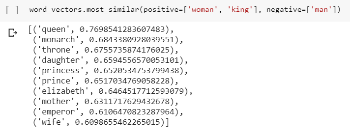
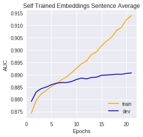

## Natural Language Processing - Sentiment Analysis

This repository contains three notebooks which each create a different NLP model to predict the sentiment (positive or negative) of a movie review.

The dataset are IMDB movie reviews and can be found [here](https://www.kaggle.com/utathya/imdb-review-dataset).

#### Part 1
View on [colab](https://colab.research.google.com/drive/1YQm_uZvSVQ3vvfVrkeVDu-Ru2osVuHyU)
Pretrained work embeddings (from [GloVe](https://nlp.stanford.edu/projects/glove/)) with 100 dimensions are used. The input to the network is the average of the word embeddings of each word in the review.

The trained model achieves an AUC of 0.88 on the test dataset.

As well as training a model, part one shows some of the fun things you can see when exploring word embeddings.

For example, woman + king - man = queen.

#### [Part 2](https://colab.research.google.com/drive/12kYa6bej_kei2LfCRb2m-pYgiH2yL7yN)

Using unsupervised learning self-trained word embeddings with 100 dimensions are created. The input to the network is the average of the word embeddings of each word in the review.

The trained model achieves an AUC of 0.88 on the test dataset.

Despite experimenting with different values of L2 regularisation, the models trained with self-trained word embeddings have a tendency to over fit.

#### You can see my portfolio [here](http://benjaminphillips22.github.io).